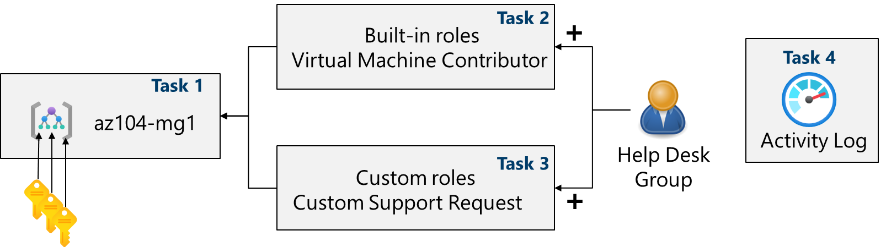
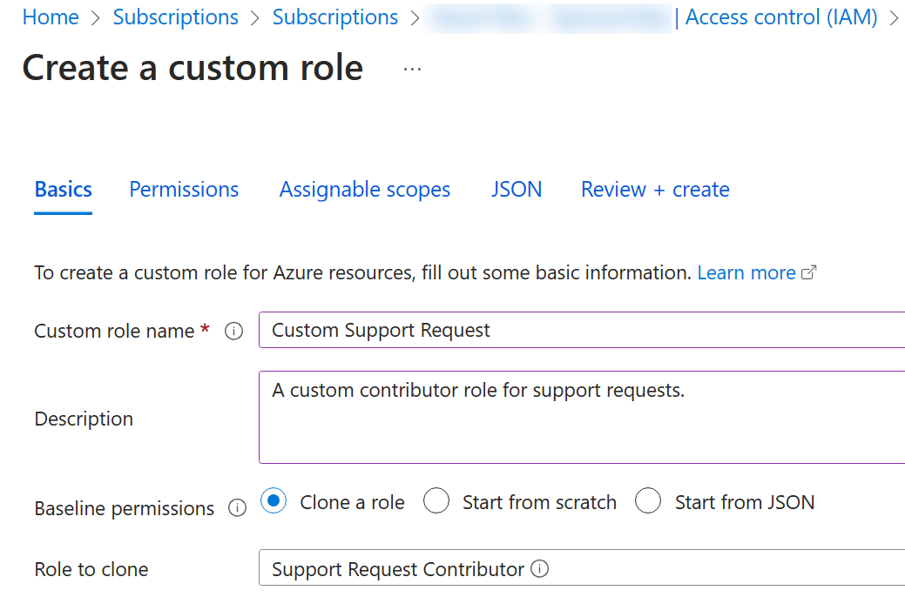
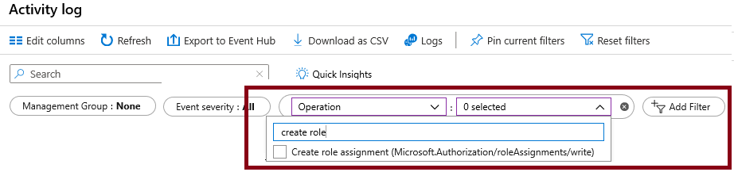

Lab 02 - Manage Subscriptions and RBAC
=======================================

Lab introduction
----------------

In this lab, you learn about role-based access control. You learn how to use permissions and scopes to control what actions identities can and cannot perform. You also learn how to make subscription management easier using management groups.

This lab requires an Azure subscription. Your subscription type may affect the availability of features in this lab. You may change the region, but the steps are written using **East US**.

Lab scenario
------------

To simplify management of Azure resources in your organization, you have been tasked with implementing the following functionality:

*   Creating a management group that includes all your Azure subscriptions.
*   Granting permissions to submit support requests for all subscriptions in the management group. The permissions should be limited only to:
    *   Create and manage virtual machines
    *   Create support request tickets (do not include adding Azure providers)

Architecture diagram
--------------------

Job skills
----------
*   Task 1: Implement management groups.
*   Task 2: Review and assign a built-in Azure role.
*   Task 3: Create a custom RBAC role.
*   Task 4: Monitor role assignments with the Activity Log.

Task 1: Implement Management Groups
-----------------------------------
In this task, you will create and configure management groups. Management groups are used to logically organize and segment subscriptions. They allow for RBAC and Azure Policy to be assigned and inherited by other management groups and subscriptions. For example, if your organization has a dedicated support team for Europe, you can organize European subscriptions into a management group to provide the support staff access to those subscriptions (*without providing individual access to all subscriptions* ). In our scenario, everyone at the Help Desk will need to create a support request across all subscriptions.

1.  Sign in to the .
2.  Search for and select **Microsoft Entra ID**.
3.  In the **Manage** blade, select **Properties**.
4.  Review the **Access management for Azure resources** area. Ensure you can manage access to all Azure subscriptions and management groups in the tenant.
5.  Search for and select **Management groups**.
6.  On the **Management groups** blade, click **\+ Create**.
* **Setting / Value**
* **Management group ID:** az104-mg155357403 *(must be unique in the directory)*
* **Management group display name:** az104-mg155357403
7.  **Refresh** the management group page to ensure your new management group displays. This may take a minute.

Task 2: Review and assign a built-in Azure role
-----------------------------------------------
In this task, you will review the built-in roles and assign the VM Contributor role to a member of the Help Desk. Azure provides a large number of .

1.  Select the **az104-mg155357403** management group.  
2.  Select the **Access control (IAM)** blade, and then the **Roles** tab.   
3.  Scroll through the built-in role definitions that are available. **View** a role to get detailed information about the **Permissions**, **JSON**, and **Assignments**. You will often use _owner_, _contributor_, and _reader_.   
4.  Select **\+ Add**, from the drop-down menu, select **Add role assignment**.
5.  On the **Add role assignment** blade, search for and select the **Virtual Machine Contributor**. The Virtual machine contributor role lets you manage virtual machines, but not access their operating system or manage the virtual network and
storage account they are connected to. This is a good role for the Help Desk. Select **Next**.
6. On the Members tab, select **Members**.
7.  Search for and select the IT Helpdesk group. Click **Select**.  
9.  Click **Review + assign** twice to create the role assignment.
10. Continue on the **Access control (IAM)** blade. On the **Role assignments** tab, confirm the **IT Helpdesk** group has the **Virtual Machine Contributor** role.

Task 3: Create a custom RBAC role
---------------------------------
In this task, you will create a custom RBAC role. Custom roles are a core part of implementing the principle of least privilege for an environment. Built-in roles might have too many permissions for your scenario. We will also create a new role and remove permissions that are not necessary.

1. Continue working on your management group. Navigate to the **Access control (IAM)** blade.  
2. Select **\+ Add**, from the drop-down menu, select **Add custom role**.
3. On the Basics tab complete the configuration.  
* **Setting/ Value**
* **Custom role name:** Custom Support Request 55357403
* **Description:** custom contributor role for support requests.
4. For **Baseline permissions**, select **Clone a role**. In the **Role to clone** drop-down menu, select **Support Request Contributor**.

 
5. Select **Next** to move to the **Permissions** tab, and then select **\+ Exclude permissions**.   
6. In the resource provider search field, enter. Support and select **Microsoft.Support**.
7. In the list of permissions, place a checkbox next to **Other: Registers Support Resource Provider** and then select **Add**. The role should be updated to include this permission as a *NotAction*.
8.  On the **Assignable scopes** tab, ensure your management group is listed, then click **Next**.
9.  Review the JSON for the _Actions_, _NotActions_, and _AssignableScopes_ that are customized in the role.
10. Select Review + Create, and then select Create.
> Note: At this point, you have created a custom role and assigned it to the management group.
    
Task 4: Monitor role assignments with the Activity Log
-----------------------------------------------------
In this task, you view the activity log to determine if anyone has created a new role.
1.  In the portal locate the **az104-mg155357403** resource and select **Activity log**. The activity log provides insight into subscription-level events.
2.  Review the activites for role assignments. The activity log can be filtered for specific operations.

Cleanup your resources
----------------------
*   In the Azure portal, select the resource group, select **Delete the resource group**, **Enter resource group name**, and then click **Delete**. 
*   Using Azure PowerShell, Remove-AzResourceGroup -Name resourceGroupName.  
*   Using the CLI, az group delete --name resourceGroupName.

Key takeaways
-------------
*   Management groups are used to logically organize subscriptions.
*   The built-in root management group includes all the management groups and subscriptions.
*   Azure has many built-in roles. You can assign these roles to control access to resources.
*   You can create new roles or customise existing roles.
*   Roles are defined in a JSON formatted file and include _Actions_, _NotActions_, and _AssignableScopes_.
*   You can use the Activity Log to monitor role assignments.
  
Learn more with self-paced training.
-----------------------------------
*   [Secure your Azure resources with Azure role-based access control (Azure RBAC)](https://learn.microsoft.com/training/modules/secure-azure-resources-with-rbac/). Use Azure RBAC to manage access to resources in Azure.
