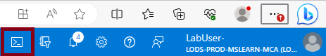

Lab 04 - Manage Azure resources by using Azure Resource Manager Templates
=========================================================================

Lab introduction
------------------
In this lab, you learn how to automate resource deployments. You learn about Azure Resource Manager templates and Bicep templates. You learn about the different ways of deploying the templates.
This lab requires an Azure subscription. Your subscription type may affect the availability of features in this lab. You may change the region, but the steps are written using East US.

Lab scenario
---------------
Your team wants to look at ways to automate and simplify resource deployments. Your organization is looking for ways to reduce administrative overhead, reduce human error and increase consistency.
Architecture diagram

Job skills
------------
* **Task 1:** Create an Azure Resource Manager template.
* **Task 2:** Edit an Azure Resource Manager template and redeploy the template.
* **Task 3:** Configure the Cloud Shell and deploy a template with Azure PowerShell.
* **Task 4:** Deploy a template with the CLI.
* **Task 5:** Deploy a resource by using Azure Bicep.

Task 1: Create an Azure Resource Manager template
--------------------------------------------------
In this task, we will create a managed disk in the Azure portal. Managed disks are storage designed to be used with virtual machines. Once the disk is deployed you will export a template that you can use in other deployments.

1. Sign in to the .
2. Search for and select **Disks**.
3. On the Disks page, select **Create**.
4. On the **Create a managed disk page**, configure the disk and then select **Ok**.
    **Setting / Value**
    * **Subscription:** 	your subscription
    * **Resource Group:** 	az104-rg3 (If necessary, select Create new.)
    * **Disk name:** 	az104-disk1
    * **Region:** 	East US
    * **Availability zone:** No infrastructure redundancy required
    * **Source type:** 	None
    * **Performance:** 	Standard HDD (change size)
    * **Size:** 	32 Gib

> Note: We are creating a simple managed disk so you can practice with templates. Azure managed disks are block-level storage volumes that are managed by Azure.

5. Click **Review + Creat**e, then select **Create**.
6. Monitor the notifications (upper right) and after the deployment select **Go to resource**.
7. In the Automation blade, select **Export template**. Take a minute to review the Template and Parameters files.
8. Click **Download** and save the templates to the local drive. This creates a compressed zipped file.
9. Use File Explorer to extract the content of the downloaded file into the Downloads folder on your computer. Notice there are two JSON files (template and parameters).

Task 2: Edit an Azure Resource Manager template and then redeploy the template
------------------------------------------------------------------------------

In this task, you use the downloaded template to deploy a new managed disk. This task outlines how to quicky and easily repeat deployments.

1. In the Azure portal, search for and select **Deploy a custom template**.
2. On the Custom deployment blade, notice there is the ability to use a Quickstart template. There are many built-in templates, as shown in the drop-down menu.
3. Instead of using a Quickstart, select **Build your own template in the editor**.
4. On the Edit template blade, click **Load file** and **upload the template.json file** you downloaded to the local disk.
5. Within the editor pane, make these changes.
        - Change disks_az104_disk1_name to disk_name (two places to change)
        - Change az104-disk1 to az104-disk2 (one place to change)

> Note *this is a Standard disk. The location is eastus. The disk size is 32GB.*

6. **Save** your changes.
7. Don't forget the parameters file. Select **Edit parameters**, click **Load file and upload the parameters.json**. Make this change so it matches the template file.
8. **Change** disks_az104_disk1_name to disk_name (one place to change)
9. **Save** your changes.
10. Complete the custom deployment settings:
**Setting /	Value**
* **Subscription:** 	your subscription
* **Resource Group:** 	az104-rg3
* **Region:** 	(US) East US
* **Disk_name:** 	az104-disk2

11. Select **Review + Create** and then select **Create**.
12. Select **Go to resource**. Verify az104-disk2 was created.
13. On the Overview blade, select the **resource group**, az104-rg3. You should now have two disks.
14. In the Settings section, click **Deployments**.
> Note: *All deployment details are documented in the resource group. It is a good practice to review the first few template-based deployments to ensure success prior to using the templates for large-scale operations.*
15. Select a deployment and review the content of the Input and Template blades.

Task 3: Configure the Cloud Shell and deploy a template with PowerShell
-----------------------------------------------------------------------
In this task, you work with the Azure Cloud Shell and Azure PowerShell. Azure Cloud Shell is an interactive, authenticated, browser-accessible terminal for managing Azure resources. It provides the flexibility of choosing the shell experience that best suits the way you work, either Bash or PowerShell. In this task, you use PowerShell to deploy a template.

1. Select the Cloud Shell icon in the top right of the Azure Portal. Alternatively, you can navigate directly to https://shell.azure.com.

2. When prompted to select either Bash or PowerShell, select PowerShell.
3. On the Getting started screen, select Mount storage account, select your Storage account subscription, and then select Apply.
4. Select I want to create a storage account and then Next. Complete the Create storage account information.
**Settings 	Values**
* **Resource Group:** 	az104-rg3
* **Region:** 	select your region
* **Storage account (Create new):** 	must be globally unique, between 3 and 24 characters in length and use numbers and lower case letters only
* **File share (Create new):** 	fs-cloudshell

5. When completed, select **Create**. (*It will take a couple of minutes to provision the storage.*)
7. Select **Settings** (top bar) and then **Go to classic version.**
8. Select the **Upload/Download files** icon (top bar) and then select **Upload**.
9. **Upload both the template and parameters files** from the Downloads directory.
10. Select the **Editor (curly brackets) icon** and **navigate to the template JSON fil**e on the left in the navigation pane.
11. **Make a change**. For example, **change the disk name to az104-disk3**. Use **Ctrl +S** to save your changes. You can target your template deployment to a resource group, subscription, management group, or tenant. Depending on the scope of the deployment, you use different commands.
12. To deploy to a resource group, use **New-AzResourceGroupDeployment**.

    `powershellTypeCopy`
    `New-AzResourceGroupDeployment -ResourceGroupName az104-rg3 -TemplateFile template.json -TemplateParameterFile parameters.jsonv`

13. Ensure the command completes and the ProvisioningState is Succeeded.
14. Confirm the disk was created.

   `powershellTypeCopy` 
   `Get-AzDisk | ft`

Task 4: Deploy a template with the CLI
--------------------------------------
1. Continue in the **Cloud Shell**, select **Bash**. **Confirm** your choice.
2. Verify your files are available in the Cloud Shell storage. If you completed the previous task, your template files should be available.

    `shTypeCopy`
    `ls`

3. Select the **Editor** (curly brackets) icon and navigate to the template JSON file.
4. Make a change. For example, change the disk name to **az104-disk4**. Use **Ctrl + S** to save your changes.

> Note: You can target your template deployment to a resource group, subscription, management group, or tenant. Depending on the scope of the deployment, you use different commands.

5. To deploy to a resource group, use **az deployment group create**.

    `shTypeCopy
    `az deployment group create --resource-group az104-rg3 --template-file template.json --parameters parameters.json

6. Ensure the command completes and the ProvisioningState is Succeeded.
7. Confirm the disk was created.

    `shTypeCopy`
    `az disk list --output table`

Task 5: Deploy a resource by using Azure Bicep
----------------------------------------------

1. In this task, you will use a Bicep file to deploy a managed disk. Bicep is a declarative automation tool that is built on ARM templates.
2. Locate the **F:\Allfiles\Labs\03\azuredeploydisk.bicep** file.
3. Continue working in the **Cloud Shell** in a **Bash** session.
4. Select **Manage files** and then **Upload** the Bicep file to the Cloud Shell.
5. Click **Editor** and when prompted, **confirm** the switch to the Classic Cloud Shell.
6. Select the **azuredeploydisk.bicep** file
7. Take a minute to read through the Bicep template file. Notice how the disk resource is defined.
8. Make the following changes:
   - Change the **managedDiskName** value, line 2, to **az104-disk5**.
   - Change the **sku name** value, line 26, to **StandardSSD_LRS**.
   - Change the **diskSizeinGiB** value; line 7, to **32**.

9. Use **Ctrl + S** to save your changes.
10. Now, deploy the template.

    `TypeCopy`
    `az deployment group create --resource-group az104-rg3 --template-file azuredeploydisk.bicep`

11. Confirm the disk was created.

    `shTypeCopy`
    `az disk list --output table`

Key takeaways
-------------
Here are the main takeaways for this lab.

    - Azure Resource Manager templates let you deploy, manage, and monitor all the resources for your solution as a group, rather than handling these resources individually.
    - An Azure Resource Manager template is a JavaScript Object Notation (JSON) file that lets you manage your infrastructure declaratively rather than with scripts.
    - Rather than passing parameters as inline values in your template, you can use a separate JSON file that contains the parameter values.
    - Azure Resource Manager templates can be deployed in a variety of ways including the Azure portal, Azure PowerShell, and CLI.
    - Bicep is an alternative to Azure Resource Manager templates. Bicep uses a declarative syntax to deploy Azure resources.
    - Bicep provides concise syntax, reliable type safety, and support for code reuse. Bicep offers a first-class authoring experience for your infrastructure-as-code solutions in Azure.

Cleanup your resources
----------------------

Ensure resources are freed up and the cost is minimized. The easiest way to delete the lab resources is to delete the lab resource group.

    In the Azure portal, select the resource group, select Delete the resource group, enter the resource group name, and then click Delete.
    Using Azure PowerShell, Remove-AzResourceGroup -Name resourceGroupName.
    Using the CLI, az group delete --name resourceGroupName.

Extend your learning with Copilot.
---------------------------------

    - What is the format of the Azure Resource Manager template file? Explain each component with examples.
    - How do I use an existing Azure Resource Manager template?
    - Compare and contrast Azure Resource Manager templates and Azure Bicep templates.

Learn more with self-paced training.
-----------------------------------

    - Deploy Azure infrastructure by using JSON ARM templates. Write JSON Azure Resource Manager templates (ARM templates) by using Visual Studio Code to deploy your infrastructure to Azure consistently and reliably.
    - Review the features and tools for Azure Cloud Shell. Cloud Shell features and tools.
    - Manage Azure resources with Windows PowerShell. This module explains how to install the necessary modules for cloud services management and use PowerShell commands to perform simple administrative tasks on cloud resources like Azure virtual machines, Azure subscriptions and Azure storage accounts.
    - Introduction to Bash. Use Bash to manage IT infrastructure.
    - Build your first Bicep template. Define Azure resources within a Bicep template. Improve the consistency and reliability of your deployments, reduce the manual effort required, and scale your deployments across environments. Your template will be flexible and reusable by using parameters, variables, expressions, and modules.

