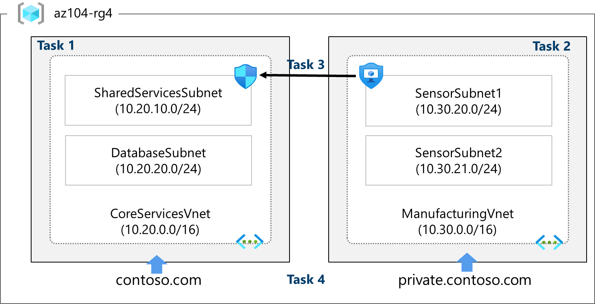

Lab 05 - Implement Virtual Networking
=====================================

Lab introduction
----------------

This lab is the first of three labs that focus on virtual networking. In this lab, you learn the basics of virtual networking and subnetting. You learn how to protect your network with network security groups and application security groups. You also learn about DNS zones and records.

Lab scenario
------------

Your global organization plans to implement virtual networks. The immediate goal is to accommodate all the existing resources. However, the organization is in a growth phase and wants to ensure there is additional capacity for the growth.

The CoreServicesVnet virtual network has the largest number of resources. A large amount of growth is anticipated, so a large address space is necessary for this virtual network.

The ManufacturingVnet virtual network contains systems for the operations of the manufacturing facilities. The organization is anticipating a large number of internally connected devices for its systems to retrieve data from.

Architecture diagram
--------------------

Network layout
--------------

These virtual networks and subnets are structured in a way that accommodates existing resources yet allows for the projected growth. Let's create these virtual networks and subnets to lay the foundation for our networking infrastructure.

Job skills
----------

* **Task 1:** Create a virtual network with subnets using the portal.
* **Task 2:**: Create a virtual network and subnets using a template.
* **Task 3:** Create and configure communication between an Application Security Group and a Network Security Group.
* **Task 4:** Configure public and private Azure DNS zones.

Task 1: Create a virtual network with subnets using the portal
--------------------------------------------------------------

The organization plans a large amount of growth for core services. In this task, you create the virtual network and the associated subnets to accommodate the existing resources and planned growth. In this task, you will use the Azure portal.

1. Sign in to the .
2. Search for and select **Virtual Networks**.
3. Select **Create** on the Virtual networks page.
4. Complete the Basics tab for the CoreServicesVnet.
   
    * **Option** / **Value**
    * **Resource Group:** 	az104-rg4 (if necessary, create new)
    * **Name:** 	CoreServicesVnet
    * **Region:** 	(US) East US
5. Move to the IP Addresses tab.
    * **Option** / **Value**
    * **IPv4 address space:** 	Replace the prepopulated IPv4 address space with 10.20.0.0/16 (separate the entries)
7. Select **+ Add** a subnet. Complete the name and address information for each subnet. Be sure to select Add for each new subnet. Be sure to delete the default subnet - either before or after creating the other subnets.

Subnet SharedServicesSubnet
---------------------------
- **Option** / **Value**
    - **Subnet name:**  SharedServicesSubnet
    - **Starting address:** 10.20.10.0
    - **Size:** /24

- **DatabaseSubnet**
    - **Subnet name:** DatabaseSubnet
    - **Starting address:** 10.20.20.0
    - **Size:** /24

> Note: Every virtual network must have at least one subnet. Reminder that five IP addresses will always be reserved, so consider that in your planning.

7. To finish creating the CoreServicesVnet and its associated subnets, select **Review + create**.
8. Verify your configuration passed validation, and then select **Create**.
9. Wait for the virtual network to deploy and then select **Go to resource**.
10. Take a minute to verify the Address space and the Subnets. Notice your other choices in the Settings blade.
11. In the Automation section, select Export template, and then wait for the template to be generated.
12. **Download** the template.
13. Navigate on the local machine to the Downloads folder and extract all the files in the downloaded zip file.
14. Before proceeding, ensure you have the template.json file. You will use this template to create the ManufacturingVnet in the next task.

Task 2: Create a virtual network and subnets using a template
-------------------------------------------------------------

In this task, you create the ManufacturingVnet virtual network and associated subnets. The organization anticipates growth for the manufacturing offices, so the subnets are sized for the expected growth. For this task, you use a template to create the resources.

1. Locate the template.json file exported in the previous task. It should be in your Downloads folder.
2. Edit the file using the editor of your choice. Many editors have a change all occurrences feature. If you are using Visual Studio Code, be sure you are working in a trusted window and not in restricted mode. Consult the architecture diagram to verify the details.
3. Make changes for the ManufacturingVnet virtual network
3.1. Replace all occurrences of CoreServicesVnet with ManufacturingVnet.
3.2. Replace all occurrences of 10.20.0.0 with 10.30.0.0.
3.3. Make changes for the ManufacturingVnet subnets
3.4. Change all occurrences of SharedServicesSubnet to SensorSubnet1.
3.5. Change all occurrences of 10.20.10.0/24 to 10.30.20.0/24.
3.6. Change all occurrences of DatabaseSubnet to SensorSubnet2.
3.7. Change all occurrences of 10.20.20.0/24 to 10.30.21.0/24.
4. Read back through the file and ensure everything looks correct. Use the architecture diagram for resource names and IP addresses. Be sure to save your changes.

> Note: There is a completed template file in the lab files directory.

5. Make changes to the parameters file
6. Locate the parameters.json file exported in the previous task. It should be in your Downloads folder. Edit the file using the editor of your choice.
7. Replace the one occurrence of CoreServicesVnet with ManufacturingVnet.
8. Save your changes.
9. Deploy the custom template

    In the portal, search for and select Deploy a custom template.

    Select Build your own template in the editor and then Load file.

    Select the template.json file with your Manufacturing changes, then select Save.

    Select Edit parameters, and then Load file.

    Select the parameters.json file with your Manufacturing changes, then select Save.

    Ensure your resource group, az104-rg4, is selected.

    Select Review + create and then Create.

    Wait for the template to deploy, then confirm (in the portal) that the Manufacturing virtual network and subnets were created.

    Note: If you have to deploy more than once time you may find some resources were completed and the deployment is failing. You can manually remove those resources and try again.

Task 3: Create and configure communication between an Application Security Group and a Network Security Group

In this task, we create an Application Security Group and a Network Security Group. The NSG will have an inbound security rule that allows traffic from the ASG. The NSG will also have an outbound rule that denies access to the internet.
Create the Application Security Group (ASG)

    In the Azure portal, search for and select Application security groups.

    Click Create and provide the basic information.
    Setting 	Value
    Subscription 	your subscription
    Resource group 	az104-rg4
    Name 	asg-web
    Region 	East US

    Click Review + create, and then after the validation,n click Create.

    Note: At this point, you would associate the ASG with virtual machine(s). These machines will be affected by the inbound NSG rule you create in the next task.

Create the Network Security Group and associate it with CoreServicesVnet

    In the Azure portal, search for and select Network security groups.

    Note: You can also locate this resource using the Azure portal menu (icon top left). Select Create a resource and then in the Networking blade, select Network security group.

    Select + Create and provide information on the Basics tab.
    Setting 	Value
    Subscription 	your subscription
    Resource group 	az104-rg4
    Name 	myNSGSecure
    Region 	East US

    Click Review + create, and then after the validation, click Create.

    After the NSG is deployed, click Go to resource.

    Under Setting,s click Subnets and then Associate.
    Setting 	Value
    Virtual network 	CoreServicesVnet (az104-rg4)
    Subnet 	SharedServicesSubnet

    Click OK to save the association.

Configure an inbound security rule to allow ASG traffic

    Continue working with your NSG. In the Settings area, select Inbound security rules.

    Review the default inbound rules. Notice that only other virtual networks and load balancers are allowed access.

    Select + Add.

    On the Add inbound security rule blade, use the following information to add an inbound port rule. This rule allows ASG traffic. When you are finished, select Add.
    Setting 	Value
    Source 	Application security group
    Source application security groups 	asg-web
    Source port ranges 	*
    Destination 	Any
    Service 	Custom (notice your other choices)
    Destination port ranges 	80,443
    Protocol 	TCP
    Action 	Allow
    Priority 	100
    Name 	AllowASG

Configure an outbound NSG rule that denies Internet access

    After creating your inbound NSG rule, select Outbound security rules.

    Notice the AllowInternetOutboundRule rule. Also notice the rule cannot be deleted and the priority is 65001.

    Select + Add and then configure an outbound rule that denies access to the internet. When you are finished, select Add.
    Setting 	Value
    Source 	Any
    Source port ranges 	*
    Destination 	Service tag
    Destination service tag 	Internet
    Service 	Custom
    Destination port ranges 	*
    Protocol 	Any
    Action 	Deny
    Priority 	4096
    Name 	DenyInternetOutbound

Task 4: Configure public and private Azure DNS zones

In this task, you will create and configure public and private DNS zones.
Configure a public DNS zone

You can configure Azure DNS to resolve host names in your public domain. For example, if you purchased the contoso.xyz domain name from a domain name registrar, you can configure Azure DNS to host the contoso.com domain and resolve www.contoso.xyz to the IP address of your web server or web app.

    In the portal, search for and select DNS zones.

    Select + Create.

    Configure the Basics tab.
    Property 	Value
    Subscription 	Select your subscription
    Resource group 	az104-rg4
    Name 	contoso.com (if reserved, adjust the name)
    Region 	East US (review the informational icon)

    Select Review, create and then Create.

    Wait for the DNS zone to deploy and then select Go to resource.

    On the Overview blade, notice the names of the four Azure DNS name servers assigned to the zone. Copy one of the name server addresses. You will need it in a future step.

    Expand the DNS Management blade and select Recordsets. Click +Add.
    Property 	Value
    Name 	www
    Type 	A
    TTL 	1
    IP address 	10.1.1.4

    Note: In a real-world scenario, you'd enter the public IP address of your web server.

    Select Add and verify your domain has an A record set named www.

    Open a command prompt, and run the following command. If you have changed the domain name, adjust.

shTypeCopy
   nslookup www.contoso.com <name server name>

    Verify the host name www.contoso.com resolves to the IP address you provided. This confirms name resolution is working correctly.

Configure a private DNS zone

A private DNS zone provides name resolution services within virtual networks. A private DNS zone is only accessible from the virtual networks that it is linked to and can't be accessed from the internet.

    In the portal, search for and select Private DNS zones.

    Select + Create.

    On the Basics tab of Create private DNS zone, enter the information as listed in the table below:
    Property 	Value
    Subscription 	Select your subscription
    Resource group 	az104-rg4
    Name 	private.contoso.com (adjust if you had to rename)
    Region 	East US

    Select Review, create and then Create.

    Wait for the DNS zone to deploy and then select Go to resource.

    Notice on the Overview blade, there are no name server records.

    Expand the DNS Management blade and then select Virtual network links. Configure the link.
    Property 	Value
    Link name 	manufacturing-link
    Virtual network 	ManufacturingVnet

    Select Create and wait for the link to be created.

    From the DNS Management blade, select + Recordsets. You would now add a record for each virtual machine that needs private name-resolution support.
    Property 	Value
    Name 	sensorvm
    Type 	A
    TTL 	1
    IP address 	10.1.1.4

   > Note: In a real-world scenario, you'd enter the IP address for a specific manufacturing virtual machine.

Key takeaways
-------------

    - A virtual network is a representation of your own network in the cloud.
    - When designing virtual networks, it is a good practice to avoid overlapping IP address ranges. This will reduce issues and simplify troubleshooting.
    - A subnet is a range of IP addresses in the virtual network. You can divide a virtual network into multiple subnets for organization and security.
    - A network security group contains security rules that allow or deny network traffic. There are default incoming and outgoing rules which you can customise to your needs.
    - Application security groups are used to protect groups of servers with a common function, such as web servers or database servers.
    - Azure DNS is a hosting service for DNS domains that provides name resolution. You can configure Azure DNS to resolve host names in your public domain. You can also use private DNS zones to assign DNS names to virtual machines (VMs) in your Azure virtual networks.

Learn more with self-paced training
----------------------------------

    - Introduction to Azure Virtual Networks. Design and implement core Azure Networking infrastructure such as virtual networks, public and private IPs, DNS, virtual network peering, routing, and Azure Virtual NAT.
    - Design an IP addressing scheme. Identify the private and public IP addressing capabilities of Azure and on-premises virtual networks.
    - Secure and isolate access to Azure resources by using network security groups and service endpoints. Network security groups and service endpoints help you secure your virtual machines and Azure services from unauthorised network access.
    - Host your domain on Azure DNS. Create a DNS zone for your domain name. Create DNS records to map the domain to an IP address. Test that the domain name resolves to your web server.

Extend your learning with Copilot
---------------------------------

Copilot can also assist in areas not covered in the lab or where you need more information. Open an Edge browser and choose Copilot (top right) or navigate to copilot.microsoft.com. Take a few minutes to try these prompts.

    - Share the top 10 best practices when deploying and configuring a virtual network in Azure.
    - How do I use Azure PowerShell and Azure CLI commands to create a virtual network with a public IP address and one subnet?
    - Explain Azure Network Security Group inbound and outbound rules and how they are used.
    - What is the difference between Azure Network Security Groups and Azure Application Security Groups? Share examples of when to use each of these groups.
    - Give a step-by-step guide on how to troubleshoot any network issues we face when deploying a network on Azure. Also, share the thought process used for every step of the troubleshooting.
